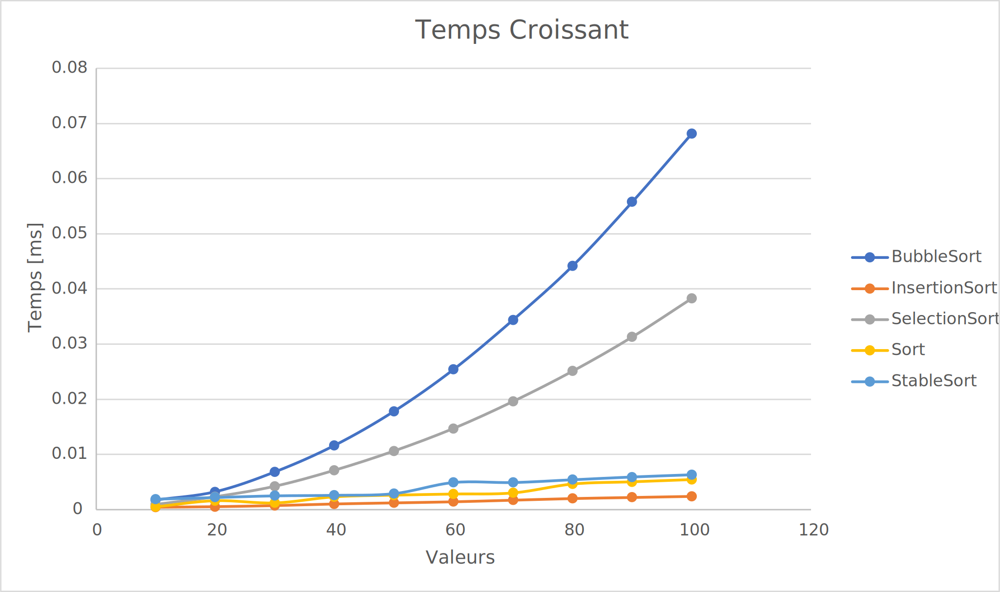

# L1 - Complexité

Editez ce fichier au format [markdown](https://github.com/adam-p/markdown-here/wiki/Markdown-Cheatsheet) pour y écrire 
votre rapport. 

Il peut être divisé un plusieurs fichiers mais README.md doit en être le point d'entrée. 

Il doit inclure des liens vers les données au format csv produites par votre code. Le fichier [example.csv](csv/example.csv) 
vous en fournit un exemple.

Il doit inclure des graphiques au format svg produit - par exemple par excel - à partir de ces 
données et illustrant votre analyse, comme les 2 exemples ci-dessous. 

Voici le graphique pour les 5 types de tris avec un vecteur trié par ordre croissant.

Nous pouvons constater que pour un petit nombre de valeurs tous les tris font presque le même temps.
Les tris d'Insertion, Sort et stable Sort font presque les mêmes temps quelque soit le nombre de donnée.
Dès que nous commencons à augmenter le nombre de valeur le tri par Bubble Sort est celui qui prend le plus de temps.
Le tris qui prend le moins de temps dans son ensemble est le tris par Insertion.
