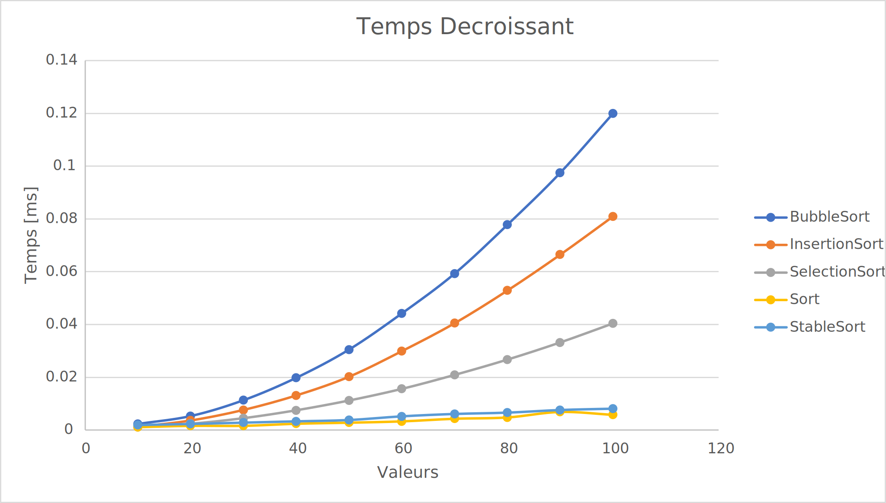
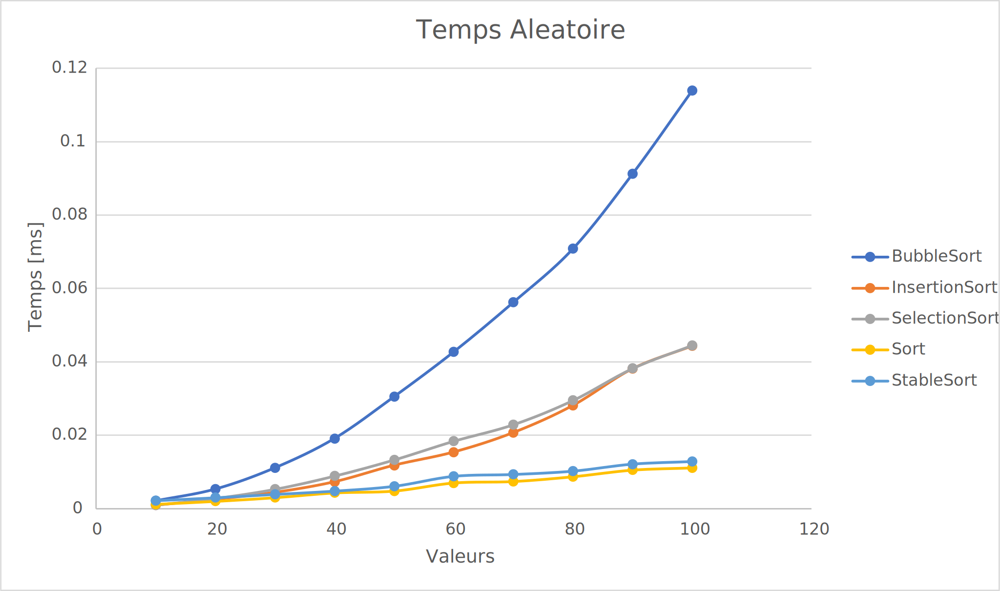

# L1 - Complexité

Editez ce fichier au format [markdown](https://github.com/adam-p/markdown-here/wiki/Markdown-Cheatsheet) pour y écrire 
votre rapport. 

Il peut être divisé un plusieurs fichiers mais README.md doit en être le point d'entrée. 

Il doit inclure des liens vers les données au format csv produites par votre code. Le fichier [example.csv](csv/example.csv) 
vous en fournit un exemple.

Il doit inclure des graphiques au format svg produit - par exemple par excel - à partir de ces 
données et illustrant votre analyse, comme les 2 exemples ci-dessous. 

## Vecteurs croissant

Nous pouvons constater que pour un petit nombre de valeurs tous les tris font presque le même temps.
Les tris d'Insertion, Sort et stable Sort font presque les mêmes temps quelque soit le nombre de donnée.
Dès que nous commencons à augmenter le nombre de valeur le tri par Bubble Sort est celui qui prend le plus de temps.
Le tris qui prend le moins de temps dans son ensemble est le tris par Insertion.

Voici les graphiques pour les 5 types de tris avec un vecteur trié par ordre croissant.

[CSV Croissant](csv/tri_croissant.csv) 

Concernant le nombre d'opérations d'affectation ou de comparaison, les tris Bubble sort et de Selection font beaucoup de comparaison par rapport
aux autres tries, ce qui les rendent moins performant pour ce type de vecteur.
Pour les autres, ils se valent à part le tri Sort de la librairie algorithme qui se démarque.

[CSV Operations Croissant](csv/operations_croissant.csv) 

## Vecteurs decroissant

Nous pouvons constater qu'avec un faible nombre de valeurs tous les tris font le même temps.
Le Tri Bubble Sort est de nouveau celui qui est le plus long avec un haut nombre de valeurs.
Le Tri par insertion cette fois ci est le deuxième plus long.
Les deux tris fourni par la librairie alogrithme sont encore les plus rapides.

Voici les graphiques pour les 5 types de tris avec un vecteur trié par ordre decroissant.

[CSV Decroissant](csv/tri_decroissant.csv)

Concernant le nombre d'opérations d'affectation ou de comparaison, les tris standards font beaucoup de comparaison et d'affectation par rapport
aux autres tries, ce qui les rendent moins performant pour ce type de vecteur.
Ceux de la librairie algorithme sont à nouveau les plus performants.

[CSV Operations Decroissant](csv/operations_decroissant.csv) 

## Vecteurs aléatoire

Nous pouvons constater qu'avec un faible nombre de valeurs tous les tris font le même temps.
Le Tri Bubble Sort est de nouveau celui qui est le plus long avec un haut nombre de valeurs.
Le Tri par insertion et par selections font le même temps de manière générale.
Les deux tris fournis par la librairie alogrithme sont encore les plus rapides.

Voici les graphiques pour les 5 types de tris avec un vecteur trié aléatoirement.

[CSV Aleatoire](csv/tri_aleatoire.csv)

D'après l'analyse ci-dessus, les tris fournis par la librairie alogrithme effectuent le moins d'opérations pour trier ce type de vecteur.

[CSV Operations Aleatoire](csv/operations_aleatoire.csv) 

## Vecteurs presque trié

Nous pouvons constater qu'avec un faible nombre de valeurs tous les tris font le même temps.
Le Tri Bubble Sort est de nouveau celui qui est le plus long avec un haut nombre de valeurs.
Le Tri par sélection est le deuxième plus long suivi du Tri par insertion.
Les deux tris fourni par la librairie alogrithme sont encore les plus rapides.

Voici les graphiques pour les 5 types de tris avec un vecteur presque trié.

[CSV Presque Trié](csv/tri_presqueTrie.csv)

D'après l'analyse ci-dessus, les tris fournis par la librairie alogrithme effectuent le moins d'opérations pour trier ce type de vecteur

[CSV Operations Presque Trié](csv/operations_presqueTrie.csv)

